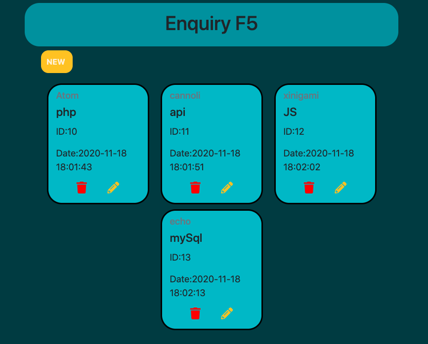
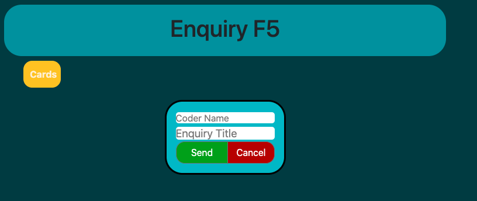
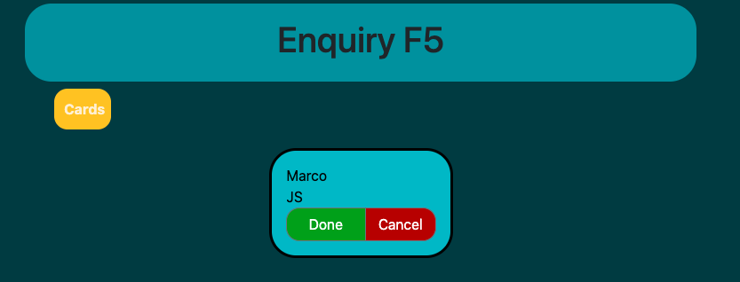

# MVC CRUD

## Requiered

- PHP 7.4
- Composer installed

## Install

- composer install

## Run Tests

- vendor/bin/phpunit

# Contexto del proyecto

### Team Workin the Bootcamp Factoría F5.

# MVC CRUD

## Requiered

- PHP 7.4
- Composer installed

## Install

- composer install

## Run Tests

- vendor/bin/phpunit

## Bootcamp F5 Excercise

### The Clinic

Our company is a development company and we need an application that allows us to request an appointment with the CTO to solve technical problems of the development teams.

At the moment we are going to develop a minimum viable product (MVP). We will start with a spaghetti code, in PHP and try to arrive at an object-oriented application using the MVC pattern (Model, View, Controller).

#### Technical requirements:

- CRUD type application (Create, Read, Update, Delete)
- It should be Object Oriented with the MVC pattern
- It should be on a free server in production.
- Git should be used with good practices in commits.
- The repository should contain a Readme with an explanation of the project, and an explanation of how to install or run the application.

### Card List (landing page)

### Create a card

### Edit Card 

